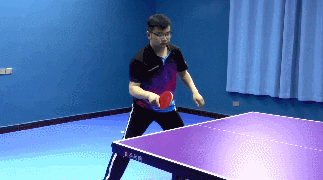
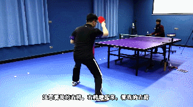

```python
###
```


```python

```


```python
Гипотеза:
```

<audio controls>
 <source src="thread-148075-1-1/me.mp3" type="audio/mpeg">
 
<p>This browser does not support HTML5 audio</p>
 </audio>


```python
style="float:left; margin-right:10px;"
<br/>[Episode 85: how to improve the quality of the veneer veneer top crotch?](http://www.pingpangwang.com/thread-148075-1-1.html)
"Universal solution"  Table tennis training
<br/>[]()
```


```python
####[]()
```

Today, we look at the table tennis question area called the weekliang the ball that he said, I was playing straight shot , I went to pull the general under the ball on the ball very high rate, especially with the cut or rub over it I am not afraid of the ball, but pull the ball is not the quality of the past, so soft, so he asked how to improve the quality of pulling the ball veneer veneer . 

      Then we know that the ball to rely on what to create the quality of veneer, if you just rely on friction, rub up the friction is very thin it, it may only rotate but there is no forward impact , so we said to improve the ball The quality of our vertical force, that is, from the forward to the force to be sufficient, so you can hit the ball deep, hit the ingredients will be more, so that the impact of the ball forward will be large . 

      But some of the ball will say that I hit more, could not eat the ball friction does not come to Taiwan how to do, it is about us in the process of making the film, we swing the action is very important , you can not say that I made From the back of the force before there is no friction on the ball, then from the back to the dumping, it certainly can not eat the ball under the net, then we have to pull the ball but also have a forward momentum, then the swing of the action is how , The first center of gravity to sink, the center of gravity down, and then shoot the time or forward above the force, but be careful not to just pedal, your feet do not just pedal up, when you turn forward to pedal, including you The body of gravity to move forward, this time when your swing action is rub up, that is, your arm is rubbing up the manufacture of rotation, but your center of gravity is to go to flutter pedal, so you both The friction of the power, but also the ball hit more fully . 

      First of all I only force up, the center of gravity also up, the arm also up, so to pull the words, this ball you look under the arc how will you see, only up hard, do not move forward, this ball Do not go forward, the arc is very high, it only up, the ball did not move forward the impact      



This time when you turn the arm or up, but the focus of the body, including the foot pedal turn forward, the body center of gravity forward to send a little more, look at it, so see, when your power fleeing after the ball The impact of greater, higher quality. 

      Just now we see is the forehand pull the ball, you can polish very thin, the past arc is very high, you can also pull the past very burst, high quality, but if you in the process of continuous pull or stalemate Improve the quality of veneer , because the continuous pull and you pull down the spin is not the same, pull down the spin you have a lot of time to lead to shoot, etc., but your forehand continuous pull, such as the other side to prevent you from continuous pull, this When you do not have time to shoot too much, many people can not pull the quality, continuous pull time, wait too long, have to wait until the fall of the ball pocket in the past, there is no quality , so we have to improve the continuous fast pull The quality of the veneer, hit the point early, try to control the high point or even after the rise to pull, and then the action range should not be too large, the action range is smaller, with the waist arm to force . 

      And then one of your hip turn, when we position the waist when the force, your right hip do not Chengsi, and many people pull the ball in the right foot, after pulling the center of gravity in the right foot, or the center of gravity All in the left foot, so pull also , then your right hip play what role, to help your hair, to the top of the right hip, where the hip is driven when the right hip to follow the hip together to the top, There is such a move out, do not necessarily say that the feet to go up, but you the right hip this position or hip together so top, so top out, there is the top of the force after the continuity of better, pull out the ball quality will Higher . 

      In the vicinity of the continuous pull, pay attention to look at my right hips of the force, we look at the continuous pull, there are a lot of people are so much, so a lot, so go pocket, no quality , 



So the feet to Pakistan live, support, support, as early as possible, pay attention to see my right hips, right crotch up, look at my right hips, well, look at the time in the pull, when pulling the hip 

The joints drive the right crotch forward to the top, the top out, and then hit the ball a little bit earlier , well, we see the ball after the advance, the pedal and the top of the strength of the ball after the high quality, we You can hear the sound of pops, well, this is to give the advice of the ball, but also hope that we can pull the ball when the ball can help this point, the top hip turn hip, the hips is not their top, Use the hip to drive the hip together, turn out, the power of the waist, the arm of the power to be able to play together, thank you for watching.
